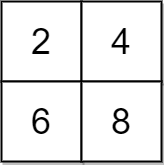
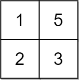
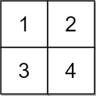
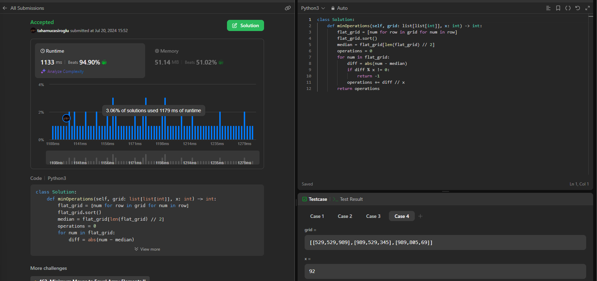

# Description

You are given a 2D integer grid of size m x n and an integer x. In one operation, you can add x to or subtract x from any element in the grid.
<br>
A uni-value grid is a grid where all the elements of it are equal.
<br>
Return the minimum number of operations to make the grid uni-value. If it is not possible, return -1.
<br>
 

Example 1:
<br>



Input: grid = [[2,4],[6,8]], x = 2<br>
Output: 4<br>
Explanation: We can make every element equal to 4 by doing the following: <br>
- Add x to 2 once.<br>
- Subtract x from 6 once.<br>
- Subtract x from 8 twice.<br>
A total of 4 operations were used.<br>


Example 2:<br>




Input: grid = [[1,5],[2,3]], x = 1<br>
Output: 5<br>
Explanation: We can make every element equal to 3.<br>


Example 3:<br>




<br>

Input: grid = [[1,2],[3,4]], x = 2<br>
Output: -1<br>
Explanation: It is impossible to make every element equal.<br>


Constraints:<br>

m == grid.length<br>
n == grid[i].length<br>
1 <= m, n <= 105<br>
1 <= m * n <= 105<br>
1 <= x, grid[i][j] <= 104<br>


# Açıklama Gpt Çevirisi


2033.Tek Değerli Bir Izgara Yapmak İçin Minimum Operasyonlar<br>

Size m x n boyutunda 2D bir tamsayı ızgarası ve bir tamsayı x veriliyor. Bir işlemde, ızgaradaki herhangi bir elemandan x çıkarabilir veya x ekleyebilirsiniz.<br>

Tek değerli bir ızgara, içindeki tüm elemanların eşit olduğu bir ızgaradır.<br>

Izgarayı tek değerli yapmak için minimum operasyon sayısını döndürün. Eğer bu mümkün değilse, -1 döndürün.<br>

Örnek 1:<br>

<br>
<br>
Girdi: grid = [[2,4],[6,8]], x = 2<br>
Çıktı: 4<br>
Açıklama: Her elemanı 4'e eşitlemek için aşağıdakileri <br>yapabiliriz:<br>

2'ye bir kez x ekleyin.<br>
6'dan bir kez x çıkarın.<br>
8'den iki kez x çıkarın.<br>
Toplamda 4 işlem kullanıldı.<br>
Örnek 2:<br>
<br>
Girdi: grid = [[1,5],[2,3]], x = 1<br>
Çıktı: 5<br>
Açıklama: Her elemanı 3'e eşit yapabiliriz.<br>
Örnek 3:<br>
<br>
Girdi: grid = [[1,2],[3,4]], x = 2<br>
Çıktı: -1<br>
Açıklama: Her elemanı eşit yapmak imkansızdır.<br>
<br>
Kısıtlamalar:<br>
<br>
m == grid.length<br>
n == grid[i].length<br>
1 <= m, n <= 10^5<br>
1 <= m * n <= 10^5<br>
1 <= x, grid[i][j] <= 10^4<br>

<br><br><br>

# İlerleyişim

Aklımka direkt olarak matriks ortalaması alıp sonra bu değere en yakın değeri yada değerleri bulup, diğer değerlerin bu sayı veya sayılara uzaklıklarını verilen değerlere bölüp adımları elde etmek geldi. Burada sorun şu 100x100 matriks verilip ortak değerin en büyük değer olma ihtimali olabilir. Galiba olabilir. bunu şuan es geçip minimum adım istediği için şuan ortanca değerlerle işlem yapacağım. 

<br><br>

### python

```
class Solution:
    def minOperations(self, grid: list[list[int]], x: int) -> int:
        flat_grid = [num for row in grid for num in row]
        flat_grid.sort()
        median = flat_grid[len(flat_grid) // 2]
        operations = 0
        for num in flat_grid:
            diff = abs(num - median)
            if diff % x != 0:
                return -1
            operations += diff // x
        return operations
```



kendi çözümüm python kısmında sorun görmememe rağmen sürekli birden fazla aynı eleman olan matrikslerde patladı bende gpt sonucunu gönderdim. 

### C#


