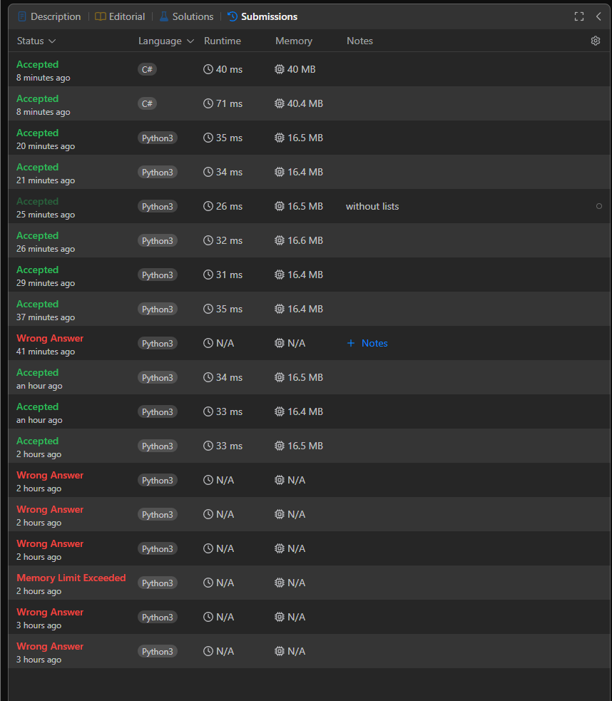

# 213. House Robber II && Difficult Easy

 
 

# ilerleme

yanlış anlamadıysam tek çift topla fazla olanı döndür deneyelim.

 

unuttuğum şey tek sayı boyundaki dizide son ile baş komşuluğunu unutmak 

 

[1,3,1,3,100]  bu dizi gelene kadar çok basit düşünmüşüm. komle farklı bir çözüme gitmem lazım.

 

en büyük sayıyı seçip kenarındakileri atacağız. bunu deneyeceğim.

 

hatanın en büyüğü 1 saattir. seçilenin çevresini direkt siliyordum fakat bu sefer fazladan silme yapıyorum istemsiz 3. adımalrda. kafam dolu galiba

 

# C# sonucu

# python sonucu 

# tüm adımlar :D

