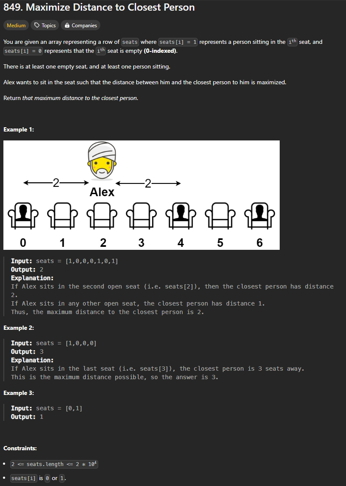
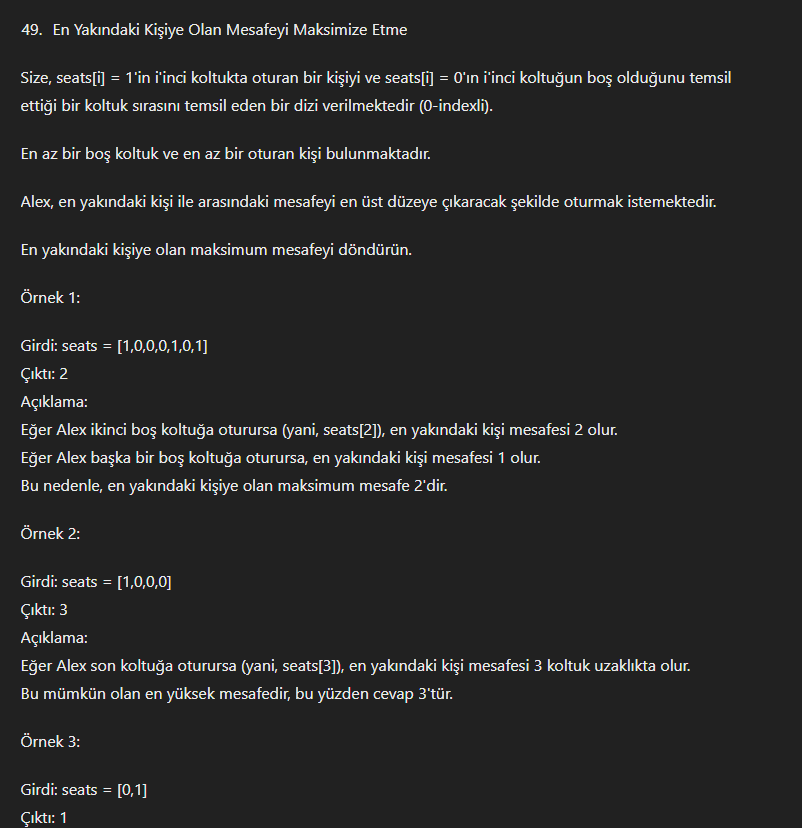
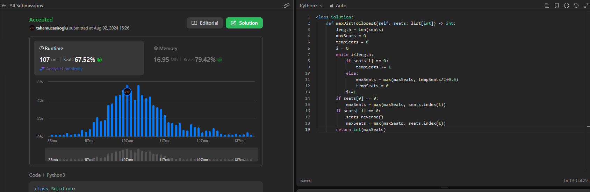
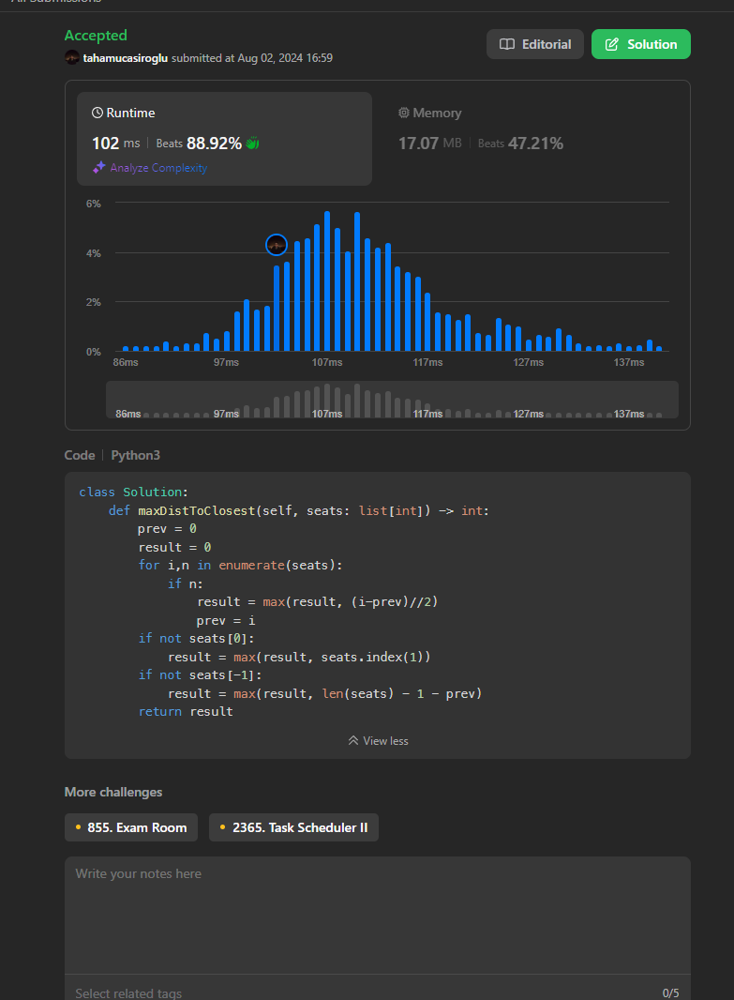
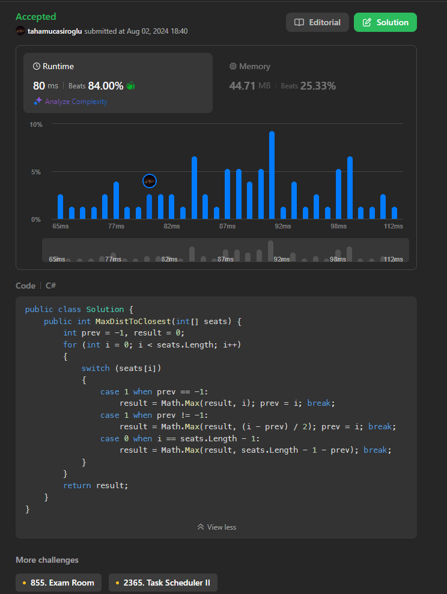
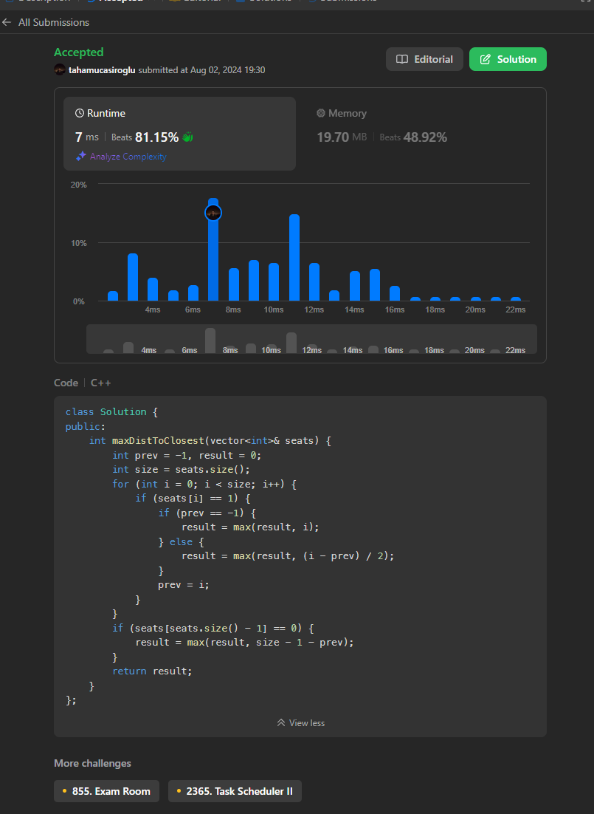

# 849. Maximize Distance to Closest Person && Difficult Medium

 
 

# GPT Çevirisi

# ilerleme

 

düz liste var. 0 ve 1. her 1 arası 0 ları sayarak en uzun olanı bulup ikiye bölemem yeterli gibi. baş ve sonra 1 olmazsa o istisnayıda hesaba katmam lazım.

 
 

 

düz mantık ilk çözüm oldu fakat sıralama kötü bakalım düzeltebilecek miyim.

 
 

# python

[Python Çözümü](https://leetcode.com/problems/maximize-distance-to-closest-person/solutions/5574733/simple)

# csharp

[CSharp Çözümü](https://leetcode.com/problems/maximize-distance-to-closest-person/solutions/5575081/switch-case)

# C++

kafam iyice gitti artık burada. unutmuşum. 

gpt ile çevirdim kodu genel olarka

